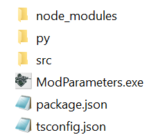

# ModParameter App

## 📖 Table of Contents  

- [ModParameter App](#modparameter-app)  
- [Features](#-features)  
  - [Search for a Weapon](#1-search-for-a-weapon-by-its-name-using-a-search-bar-to-mod-it)  
  - [Modify Weapons by Caliber](#2-select-a-group-of-weapons-based-on-their-calibers-to-mod-all)  
  - [Modify Ammunition](#3-organize-bullet-search-based-on-their-caliber-categories-to-allow-modifications)  
  - [Modify PMC Attributes](#4-modifying-pmc-attributes-in-eft)  
  - [Assign Tracers to Bullets](#5-ability-to-assign-tracer-to-all-bullets-in-the-game-and-choose-their-color)  
  - [Save Modifications](#6-saving-your-modifications-made-to)  
  - [Deletion Options](#7-deletion)  

- [🔧 Project Structure](#-typescript-project-structure)  
- [🛠 Core Components & Features](#-core-components--features)  
  - [AttributMod (Main Mod Class)](#attributmod-main-mod-class)  
  - [PmcService (PMC Attribute Management)](#pmcservice-pmc-attribute-management)  
  - [ItemService](#itemservice)  
  - [ItemUpdaterService](#itemupdaterservice)  
  - [AimingService](#aimingservice)  

- [Database Structure](#-pattern-database-item-props-structure)  
- [Weapon & Ammo Data Fetcher](#weapon--ammo-data-fetcher)  
- [License](#license)  
- [Author & Contact](#author)  

## Project Overview

1. **ModParameter** is a mod for **SPT-AKI** that allows users to dynamically modify **weapon statistics, ammunition properties, and PMC attributes** through a **graphical Python interface** with an executable `.exe` file. This mod enhances gameplay customization by enabling direct item and character modifications within the game.
2. The Python program will automatically generate JSON files that can be retrieved, corrected, and used to implement objects in the SPT database. Automation can only take place if the file structure is strictly followed, ensuring that the Python program has full visibility on the generated files.
   👉 "Read the README.md file for more information."
---
## Features : 
### 1. Search for a **weapon** by its name using a search bar to mod it.
### 2. Select a group of **weapons** based on their calibers to mod all.
📌 **Weapons** : 
- CameraSnap: Represents the speed at which the camera moves during recoil
- AimSensitivity: Sensitivity while aiming
- Ergonomics: The weapon's ergonomics
- RecoilCamera: The upward camera movement when firing a shot
- RecoilDispersion: The dispersion of the weapon's barrel when firing
- RecoilForceBack: The horizontal recoil
- RecoilForceUp: The vertical recoil
- Weight: The weapon's weight
- bFirerate: Rate of Fire

### 3. Organize bullet search based on their caliber categories to allow modifications:
📌 **Ammo** : 
- ArmorDamage: The damage dealt by the bullet to armor.  
- Damage: The raw damage a bullet deals to flesh, excluding armor absorption.  
- PenetrationPower: The bullet's penetration power.  
- InitialSpeed: The bullet's speed.  
- Tracer: Defines whether a bullet has tracer properties.  
- TracerColor: Defines the tracer bullet color, if it is set as a tracer bullet.  
- StackMaxSize: The maximum number of bullets per stack in the stash and during a raid.

### 4. Modifying PMC Attributes in EFT  
📌 **PMC** : 
- AimPunchMagnitude: The intensity at which the player's camera moves when hit by a bullet.
- RecoilHandDamping: The forward and backward camera movement when firing.  
- RecoilDamping: The vertical animation of the weapon when firing.
- ProceduralIntensity: Defines the player's stability when aiming. It is initially set based on a value of 1 (100%).
  * ProceduralIntensityByPoseStanding: Defines sway while standing.  
  * ProceduralIntensityByPoseCrouching: Defines sway while crouching.  
  * ProceduralIntensityByPoseProne: Defines sway while prone.  
    - ➡️ It is recommended to modify **ProceduralIntensityByPoseStanding**, as it serves as the reference value. If modified, the other two will adjust accordingly.  

- RecoilIntensity: The player's overall recoil across all weapons. It follows the same logic as **ProceduralIntensity**.  
  * RecoilIntensityStanding: Recoil while standing.  
  * RecoilIntensityCrouching: Recoil while crouching.  
  * RecoilIntensityProne: Recoil while prone.  

### 5. Ability to assign "tracer" to all bullets in the game and choose their color
📌 AMMO

### 6. Saving your modifications made to:
   * A group of weapons
   * A specific weapon
   * A specific bullet
   * Attributes PMC
- When you return to modify an item / PMC, your changes are saved. If you delete the modification, the save is removed.

### 7. Deletion
- Reset to default values ==> removes the save and all modifications (Weapons / Bullets / PMC)
- Delete a specific item
- Delete all weapon modifications
- Delete all bullet modifications
---
## Schéma fonctionnement
````
----------------+          +---------------+       +-------------+       +--------------+
|  Python Script  | ======> | JsonFiles Dir | ====> |  mod.js     | ====> |  SPT DB      |
|  (Generate .json) |       | (Store files) |       | (Load JSON) |       | (Map data)   |
+------------------+       +---------------+       +-------------+       +--------------+
````
---
## 📂 TypeScript Project Structure

🛠️ Use console `cmd`/ `PowerShell` to show terminal to execute `ModParameter.exe` 🛠️


```
ModParameter/
│-- ModParameter.exe       # Python exe file 
│-- package.json           # Project dependencies
│-- tsconfig.json          # TypeScript configuration
│-- node_modules           # Dependancies
│-- py/                    # Python GUI files
│-- │--JsonFiles           # JsonFiles Stock Modif. HERE
│-- │--│--Weapons           
│-- │--│--Ammo
│-- │--│--PMC
│-- │--│--Calibers
│-- src/                   # TypeScript source code
│   │-- external/          # (optional) import SPT-server
│   │-- Entity/            # Game entity definitions
│   │-- ListIdItem/        # Item ID management
│   │-- Service/           # Core services for modifying data
│   │   │-- AimingService.ts
│   │   │-- ItemService.ts
│   │   │-- ItemUpdaterService.ts
│   │   │-- JsonFileService.ts
│   │   │-- PmcService.ts
│   │-- Utils/             # Utility functions
│   │   │-- ValidateUtils.ts
│   │-- caliber.ts         # generate json calibers data
│   │-- config.ts          # Configuration settings
│   │-- mod.ts             # Main mod entry point
│   │-- scrap_ammo.ts      # Ammunition scrap data script
│   │-- scrap_weapon.ts    # Weapon scrap data script
│   │-- README.md

```
-
### 🔧 External (no need for mod)
- Personally, to implement classes and interfaces, I use "[sp-tarkov](https://github.com/sp-tarkov/server)" in external.
for : 
- ILogger Logging
- IPostDBLoadMod
- DatabaseServer 
- IDatabaseTables 
- ITemplates 
- IProps 
- ITemplateItem 
- IAiming 
- IConfig 
- IGlobals
---

## 🔧 Core Components & Features

### **AttributMod (Main Mod Class)**

The `AttributMod` class implements the `IPostDBLoadMod` interface for **SPT-AKI**. It modifies game data **after the database is loaded**, using `ItemService` and `PmcService` to apply changes.

#### ✅ Features:
- **Dependency Injection:** Uses `tsyringe` to inject required services.
- **Game Data Modification:** Alters **Weapons, ammunition, and PMC attributes**.
- **Error Handling:** Ensures essential dependencies (`DatabaseServer`, `ILogger`) are available.

#### 🔹 Key Method:
```typescript
postDBLoad(dependencyContainer: DependencyContainer): void
```
- Loads dependencies and retrieves game data.
- Applies modifications through `updateItems()` and `updatePmc()`.

#### 📌 Dependencies:
- **`DatabaseServer`** – Access to game database tables.
- **`ILogger`** – Logs information and errors.
- **`ItemService`** – Handles item modifications.
- **`PmcService`** – Manages PMC attribute updates.

---

## **PmcService (PMC Attribute Management)**

Handles **Player Main Character (PMC) attribute updates**, utilizing external services for data management.

#### ✅ Features:
- Reads **JSON configuration files** via `JsonFileService`.
- Applies **aiming modifications** using `AimingService`.
- Logs updates and errors with `ILogger`.

#### 🔹 Key Method:
```typescript
updatePmc(): void
```
- Loads **aiming configuration JSON**.
- Parses and applies modifications to **PMC aiming attributes**.

#### 📌 Dependencies:
- **`ILogger`** – Logging service.
- **`JsonFileService`** – Loads JSON configurations.
- **`AimingService`** – Applies aiming changes.

---
# ItemService

## Overview
The `ItemService` class is responsible for loading JSON files containing item data (weapons and ammunition) and applying modifications to them within the SPT game environment. This service ensures that the JSON data follows the required structure and applies appropriate updates using the `ItemUpdaterService`.

## Features
- Loads JSON data for weapons and ammunition.
- Validates the structure of the JSON files before processing.
- Applies modifications to weapons and ammunition.
- Logs warnings when encountering invalid or missing data.

## Class Methods
### `updateItems()`
This method initiates the process of updating weapons and ammunition:
- Loads JSON files using `JsonFileService`.
- Calls `caseWeapons()` to process weapon modifications.
- Calls `caseAmmo()` to process ammunition modifications.

### `caseWeapons(jsonWeaponsFiles)`
Processes weapon JSON files:
- Checks for missing or invalid weapon data.
- Extracts `ItemProps` and `Locale` from the JSON.
- Applies modifications using `ItemUpdaterService`.

### `caseAmmo(jsonAmmoFiles)`
Processes ammunition JSON files:
- Validates ammo data structure.
- Extracts `Ammo` properties.
- Creates `Ammo` instances using `createItemAmmo`.
- Applies modifications using `ItemUpdaterService`.

---
# ItemUpdaterService

## Overview
The `ItemUpdaterService` class is responsible for applying modifications to in-game items in the SPT (Single Player Tarkov) ecosystem. It maps JSON-defined modifications onto existing SPT items, ensuring that only valid values are applied.

This service primarily works with two types of items:
- **Ammunition (`Ammo`)**
- **Weapons (`ItemProps`)**

## Functionality
The `ItemUpdaterService` processes item updates through two main methods:
1. **applyAmmoModifications**: Updates ammunition properties such as damage, penetration power, initial speed, and tracer attributes.
2. **applyWeaponsModifications**: Updates weapon attributes like recoil, ergonomics, fire rate, and aiming sensitivity.

### How it Works
- The service extracts the relevant item from the SPT database (`iDatabaseTables`).
- It validates and casts each modification from the JSON input using `ValidateUtils`.
- If any value is invalid, the modification is skipped, and a warning is logged.
- If all values are valid, they are applied to the item's `_props`.
- The service logs success or failure messages accordingly.

## Notes
- This service only modifies properties that exist within `_props` of an `ITemplateItem`.
- If the database structure is invalid or an item is missing, the modification process is aborted.

---
# AimingService

## Overview
The `AimingService` class is responsible for modifying aiming-related 
attributes in the SPT (Single Player Tarkov) environment. It maps JSON-defined values onto existing SPT configurations, ensuring that only valid values are applied.

## Functionality
The `AimingService` updates the aiming parameters of a PMC based on JSON input:
- **applyModifications**: Modifies attributes related to recoil, procedural intensity, and aiming sensitivity.

### How it Works
- The service extracts the necessary data from the SPT database (`iDatabaseTables`).
- It verifies that the required configurations (`globals`, `config`, `aiming`) exist.
- It validates and casts each modification from the JSON input using `ValidateUtils`.
- If any value is invalid, the modification is skipped, and a warning is logged.
- If all values are valid, they are assigned to the corresponding `_props`.
- The service logs success or failure messages accordingly.


## Notes
- This service only modifies properties that exist within the `IAiming` and `IConfig` objects.
- If the database structure is invalid or attributes are missing, the modification process is aborted.
- Ensure JSON input is correctly formatted and validated before passing it to the service.

## License
This project follows the applicable license terms set by the SPT-AKI modding framework.

---


# Pattern Database item props structure
```
DatabaseServer
├── templates
│   ├── items                
│   │   ├── weapon_XXX      
│   │   │   ├── _id: string
│   │   │   ├── _name: string
│   │   │   ├── _props: ItemProps
│   │   │   │   ├── CameraSnap: number
│   │   │   │   ├── AimSensitivity: number
│   │   │   │   ├── Ergonomics: number
│   │   │   │   ├── RecoilCamera: number
│   │   │   │   ├── RecoilForceBack: number
│   │   │   │   ├── RecoilForceUp: number
│   │   │   │   ├── RecolDispersion: number
│   │   │   │   ├── Weight: number
│   │   │   │   ├── ammoCaliber: string
│   │   │   │   ├── bFirerate: number
│   │   ├── ammo_XXX        
│   │   │   ├── _id: string
│   │   │   ├── _name: string
│   │   │   ├── _props: Ammo
│   │   │   │   ├── ArmorDamage: number
│   │   │   │   ├── Caliber: string
│   │   │   │   ├── Damage: number
│   │   │   │   ├── InitialSpeed: number
│   │   │   │   ├── PenetrationPower: number
│   │   │   │   ├── StackMaxSize: number
│   │   │   │   ├── Tracer: boolean
│   │   │   │   ├── TracerColor: string
├── globals
│   ├── config
│   │   ├── Aiming
│   │   │   ├── AimPunchMagnitude: number
│   │   │   ├── RecoilDamping: number
│   │   │   ├── RecoilHandDamping: number
│   │   │   ├── RecoilIntensityStanding: number
│   │   │   ├── RecoilIntensityCrouching: number
│   │   │   ├── RecoilIntensityProne: number
│   │   │   ├── RecoilXIntensityByPose
│   │   │   │   ├── x: number
│   │   │   │   ├── y: number
│   │   │   │   ├── z: number
│   │   │   ├── RecoilYIntensityByPose
│   │   │   │   ├── x: number
│   │   │   │   ├── y: number
│   │   │   │   ├── z: number
│   │   │   ├── RecoilZIntensityByPose
│   │   │   │   ├── x: number
│   │   │   │   ├── y: number
│   │   │   │   ├── z: number
```
---
# Weapon & Ammo Data Fetcher

## Overview
This TypeScript script is a bonus utility designed to fetch both **weapon** and **ammunition** JSON data from the 
[SPTarkov Database API](https://db.sp-tarkov.com/api/item). 
Instead of maintaining separate scripts for each item type, this unified script efficiently handles both, reducing redundancy.

## Features
-  **Fetches weapon and ammunition data** from the SPTarkov API.
-  **Organizes data** into JSON files with properly formatted filenames.
-  **Uses a queue system** to limit concurrent requests and prevent API overload.
-  **Cleans up existing JSON files** before fetching new ones.
-  **Verifies that all expected files were created** and logs missing entries.
-  **Unified architecture** for both weapons and ammo, reducing duplicate code.

## How It Works
1. **Retrieves item IDs** from `WeaponList` and `AmmoList`.
2. **Requests item data** from `https://db.sp-tarkov.com/api/item`.
3. **Processes the response** into structured `Templates<ItemProps | Ammo>` objects.
4. **Saves JSON files** using `ShortName` as the filename.
5. **Handles API rate limits** by adding a delay between requests.
6. **Logs successes and errors** to the console.

## Dependencies
The script relies on the following libraries:
- [`axios`](https://www.npmjs.com/package/axios) - For making API requests.
- [`fs`](https://nodejs.org/api/fs.html) - For file system operations.
- [`path`](https://nodejs.org/api/path.html) - For handling file paths.
- [`p-queue`](https://www.npmjs.com/package/p-queue) - For managing concurrent API requests.
- `config.ts` - Stores the output directory paths.

## Usage
### Prerequisites
Make sure you have **Node.js** installed and run:
```sh
npm install axios p-queue
```

### Running the Script
Execute the script with:
```sh
node script.js
```

### Expected Output
- JSON files will be stored in the directories specified by `config.jsonWeaponFolderPath` and `config.jsonAmmoFolderPath`.
- The script will output logs indicating success (`✅ Saved item to ...`) and errors (`❌ Failed to fetch data for ID: ...`).
- A summary report will be displayed at the end.

## Notes
- **Concurrent Requests**: The script processes up to **5** requests at a time.
- **Rate Limiting**: A `500ms` delay prevents API overload.
- **File Cleanup**: All existing `.json` files in the output directories are deleted before new ones are created.
- **Error Handling**: Items that fail to fetch are logged and checked for missing data.
- **Unified Logic**: Instead of separate scripts, both weapons and ammo are handled in the same structure.

## License
This project follows the applicable license terms set by the SPT-AKI modding framework.

## Author

👤 **Yox**  
📧 Email: [@gmail.com](mailto:vivien.hoyaux@gmail.com)  
   GitHub: [gitlab](https://github.com/yox92/ModParameter.git)
   Discord : yox_92 1235644139

Feel free to contact me for any questions!


